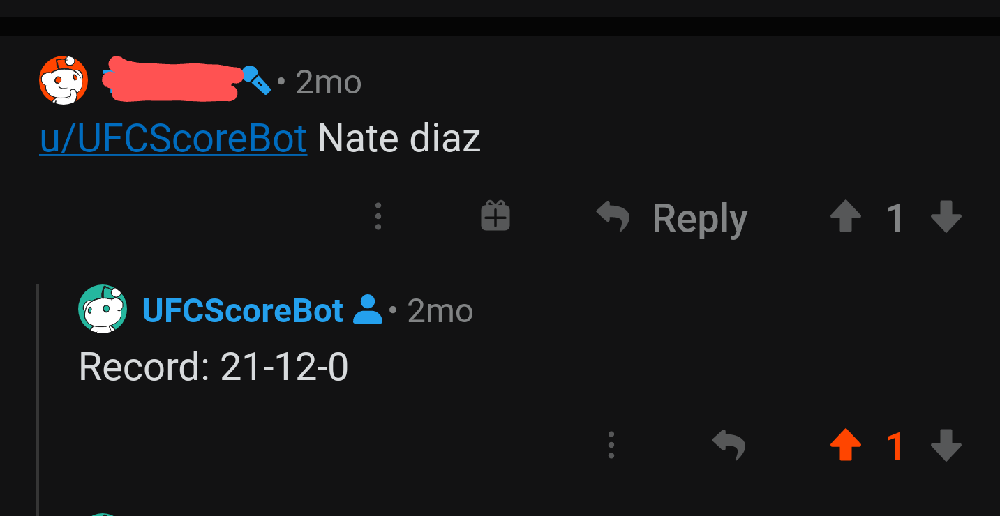

# UFCSCoreBot
> An automated system that retrieves a UFC Fighter's record upon request via Reddit.

## Table of contents
* [Motivation](#motivation)
* [General Info](#general-info)
* [Example](#example)
* [Built-With](#built-with)
* [Setup](#setup)
* [Contact](#contact)

## Motivation
The motivation for this project was to learn about web scraping by implementing a bot that searches for custom info on [www.ufcstats.com](http://ufcstats.com/statistics/events/completed)

## General Info
While running, the bot periodically listens for requests on reddit via [PRAW](https://praw.readthedocs.io/en/latest/). Look [here](https://www.reddit.com/wiki/api) for information on getting a Reddit API key and [here](https://praw.readthedocs.io/en/latest/getting_started/configuration/prawini.html) for help on connecting your account with praw. To successfully run the bot you'll need your own `praw.ini`. To exit the bot you will need to manually exit the program.

When the bot receives a request, the message is parsed to extract the fighter's first and last name and then a call to [scrapy](https://scrapy.org/) is made. 
* `scrapy crawl -a last={last_name} -a first={first_name} charlotte`

`charlotte` is the name of the file that contains instructions for custom crawling/parsing.

If a fighter is successfully found, their record will be output in a folder called `scrapy_output` in the form of a JSON file. The bot will then search this folder to reply to the requester via reddit. 

## Example
 *Requester's username omitted for obvious reasons.* 

## Built-With
* PRAW - 7.1.0
* python - 3.8.2
* Scrapy - 2.3.0

## Setup
Assuming the above is installed on your machine, acquire a Reddit API key, configure your own `praw.ini` file, place it in the root directory and run `run.py` from your terminal.

## To-do list:
* Add support for more specific requests.
* Format responses better. 

## Contact
Created by [kcharellano](https://www.linkedin.com/in/kcharellano) - feel free reach out!
